# Analyzing Finanacial Methods - Final Report

### Introduction/Background
Today, investment analysis, such as in evaluating stock position strategies, is heavily dependent on technical indicators: functions that extract predefined features from time series. The finance industry relies on technical indicators to quantify time series growth, volatility, patterns, and over/under valued limits.

### Problem Definition
Unfortunately, relying on technical indicators does not always result in profitable investments. This is partially due to the noise and natural variability in financial markets, though we aim to determine the effectiveness of technical indicators with regards to extraction of meaningful, informative features. Diving one level deeper, we wish to model which general investment strategies are most suitable for given indicator values, evaluating the contribution of technical indicators to strategy profitability.

### Data Collection

#### Collecting Stock Data
We began by scraping time series data for a set of 20 stocks in the Consumer Goods industry: Amazon, Tesla, Alibaba, Home Depot, Toyota Motors, NIke, McDonald’s, Lowes, Starbucks, JD.com, Pinduoduo, Booking Holdings, General Motors, Mercadolibre, TJ Max, Nio, Ford Motors, Lululemon Athletica, Honda Motor Co, and Chipotle Mexican Grill. The yFinance Python library allowed us to obtain 10 years of time series data per stock, organized into daily increments. Each data point gives us five values: 
- Opening Price
- Closing Price
- High
- Low
- Volume (Total Shares Traded)

#### Computing Technical Indicators
For each timestep of data collected, we used TA-Lib to collect 14 technical indicators which are commonly used to influence a stock trader’s decision-making strategies. These technical indicators include:
- **Relative Strength Index (RSI):** Oscillates between 0 and 100. Buy signal below 20, Sell signal above 80.
- **Ultimate Oscillator:** Oscillates between 0 and 100. Buy signal below 30, Sell above 70
- **Bollinger Bands:** Width of expected price range, two standard deviations
- **Chaikin Oscillator:** Oscillates between 0 and 100, signals oversold / underbought dependent on Volume
- **Normalized Average True Range (NATR):**  Measure of time series volatility and directional uncertainty
- **Simple Moving Average, 5 day, 20 day, 100 day (SMA)**: Average of last n days
- **Parabolic SAR:** Overlap indicator, buy signal when value jumps from above price to below price, and vice versa
- **Williams %R:** Oscillates between 0 and 100, signifies strength in momentum
- **Absolute Price Oscillator (APO):** Oscillator centered at 0, buy signal when crossing from negative to positive, sell signal when crossing from positive to negative
- **Rate of Change, 5 day, 20 day, 100 day (ROC):** Simple % change in price across a given period of n days

We appended these indicators as new columns of our pandas dataframe, to generate a 10 year by 19 column matrix, where each row corresponded to one day.

#### Policy Generation (Supervised)
Once having completed our unsupervised policies, we constructed ground-truth labels in preparation for supervised learning. Given the common centroids discovered through clustering, we generate four policies (two policies, each with a long and short-selling variant). In more detail, the policies are:

1. **Buy and Hold** (Long)
Express profit as the price 20 trading days into the future minus the current price.

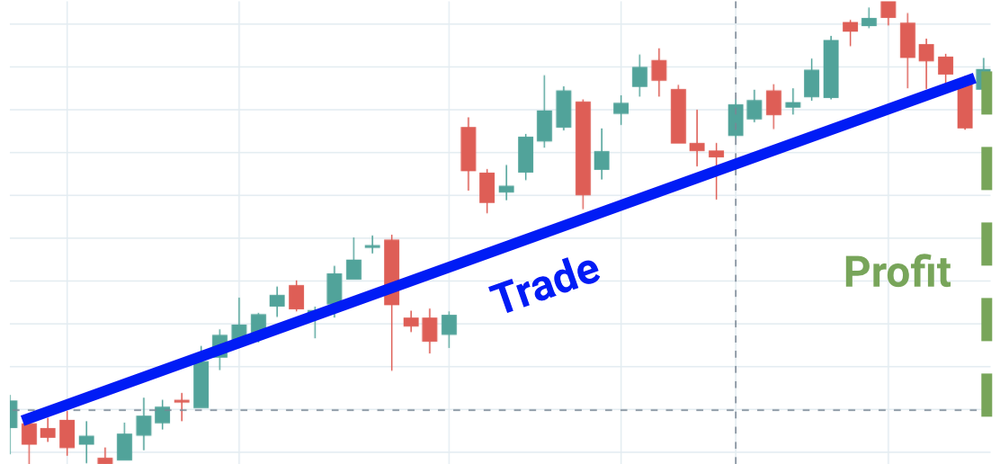

##### Pictured: a scenario where policy 1 is optimal

2. **Sell and Hold** (Short)
Express profit as the current price minus the price 20 trading days into the future. Since this is a short-selling strategy, profitability increases when price decreases over time.

##### Pictured: a scenario where policy 2 is optimal

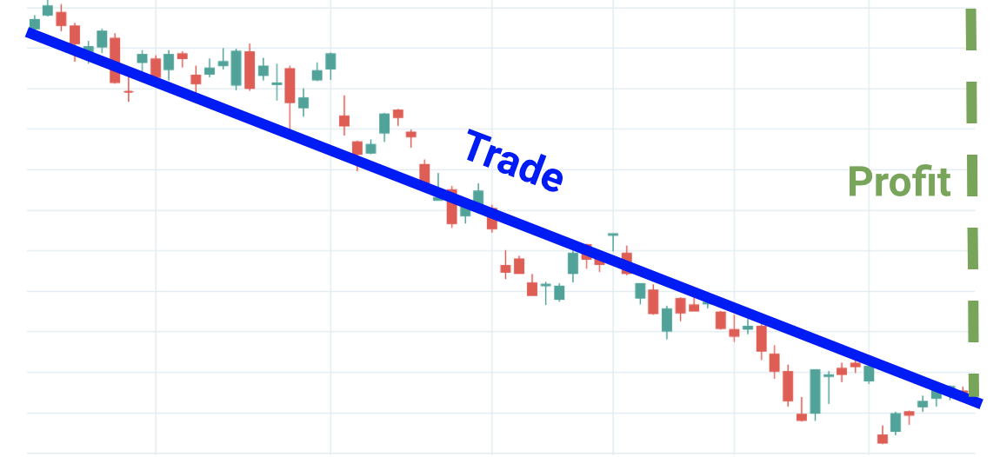

1. **Buy Trough, Sell Peak** (Long)
Greedily wait to buy the lowest trough, and sell at the highest peak over the next 20 trading days. Because greater risk is involved than the Buy and Hold policy, we assume that the trader can only obtain 50% of the swing trade profits.

##### Pictured: a scenario where policy 3 is optimal

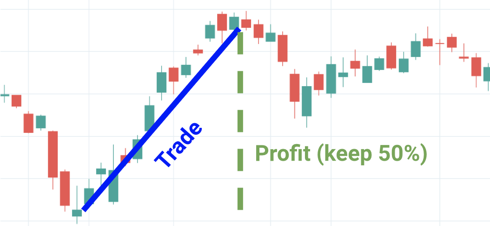

1. **Sell Peak, Buy Trough** (Short)
The short-selling variant of the third policy. Same risk assumption applies.

##### Pictured: a scenario where policy 4 is optimal

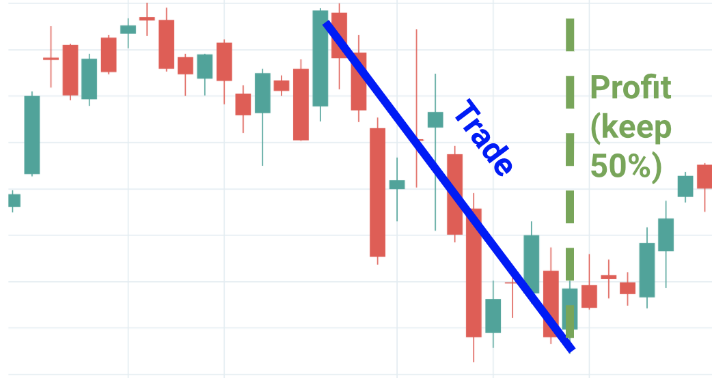

All 4 policies are computed for every time step in each stock’s time series, taking into account future stock performance. The optimal policy is chosen as that yielding greatest profit. Our goal now turns to correctly classifying each time step into the optimal policy (ground-truth) from the technical indicator features.

### Methods

#### Context
We will cluster stocks based on technical indicators (GMM). If the clusters are not well-formed (evaluated using a Silhouette matrix), then technical indicators may not be the best for making trading decisions. Otherwise, there may be n distinct trading policies (strategies), where each cluster corresponds to one policy.

Then, we will evaluate different classification models, aiming to evaluate how effectively technical indicator features can choose profitable strategies. If these methods succeed, then technical indicators play a significant, positive effect on strategy selection. Otherwise, their basis for performing profitable investments is unproductive.

#### Outlier Removal
Prior to clustering the data, we removed any outliers. This was done by calculating each feature’s euclidean to the global center, finding the Interquartile Range (IQR) of such distances, and removing any points outside the 1.5*IQR range. This would allow for better clustering results, as the data will not be skewed by a small percentage of outliers.

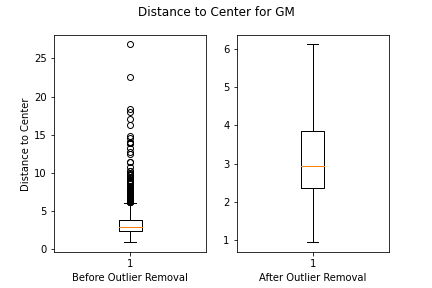

###### Visualization of Outliers in CGM Stock

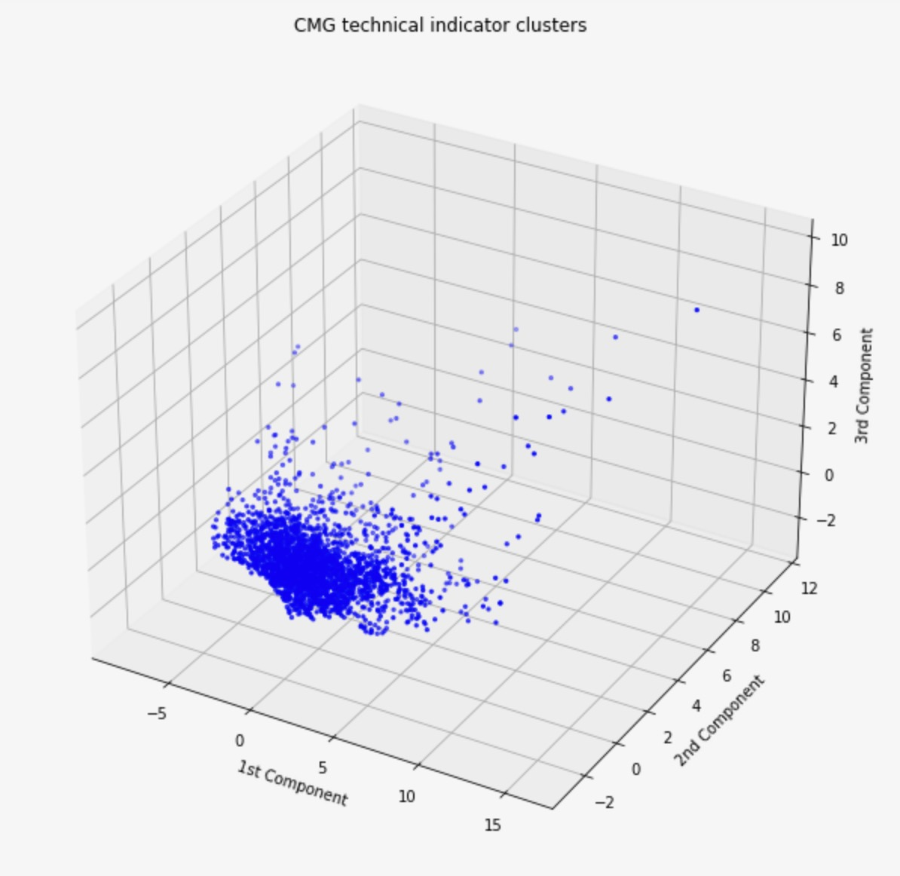

###### Visualization of CMG Stock Distances from Mean with Outliers

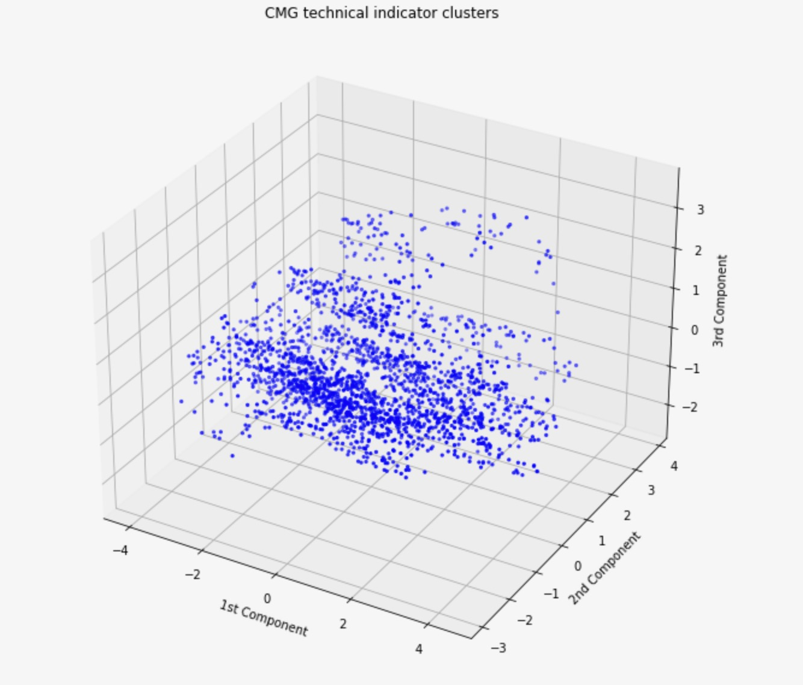

###### Visualization of CMG Stock Distances from Mean with Outliers Removed

#### Dimensionality Reduction Using PCA
In order to visualize the technical indicators for each stock, we reduced our data down to 3 dimensions using PCA. We did this before clustering to manually inspect whether our features could be separated into well-defined clusters. 
To reduce the data to three dimensions, we projected technical indicators along the top three principal components. In this new 3-dimensional space, each data point is a linear combination of data from the original 14-D featurespace. Therefore, if we can see m distinct clusters in three dimensions after performing PCA, then the technical indicators will also have at least m distinct clusters.
PCA was performed on the data using the Sci-Kit Learn library. Prior to performing PCA, we used Sci-Kit Learn’s StandardScaler class to center the data.
Looking at the top three principal components, we can see that the technical indicators for certain stocks form distinct clusters. For Toyota (ticker TM), for example, there are four clear clusters in the reduced data. However, other stocks like Amazon did not have any discernible clusters using the first three principal components. 

###### Visualization of Toyota Stock's Technical Indicator Clusters

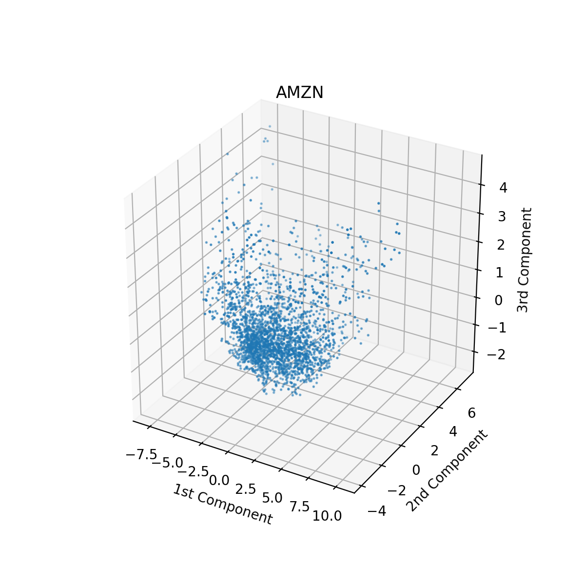

###### Visualization of Amazon Stock's Technical Indicator Clusters

#### Clustering Using GMM
Rather than using K-Means, which is restricted to circular clusters, we chose to use the GMM algorithm with a full covariance matrix. This would give us irregular-shaped clusters, which would be more capable of representing the data. We used Sci-Kit Learn’s GMM function, in which we passed in multiple different cluster numbers, ranging from 1-14. We calculated the BIC (minimize), AIC (minimize), and Silhouette Score (maximize) for each run of GMM, and used whichever metric signaled optimality first to select the number of clusters for each stock. AIC and BIC attempt to optimize the probabilistic assignment for each point, though BIC additionally penalizes models with more clusters without reasonable information gain. From here, we were able to calculate the centroids of the clusters, and store them for use later when choosing ground-truth policies for the stocks.
We ran GMM on the original 14 dimension data, and then we ran GMM on the data preprocessed by PCA.

---

After performing our unsupervised learning algorithms,  we will employ a series of supervised learning algorithms based on our ground-truth policies. This should allow us to better create a more generalized model for predictive use cases.

#### Classification using Naive Bayes
Often known as the simplest form of supervised learning, Naive Bayes makes a large number of assumptions when training a classifier model. We wanted to see if our data was robust enough that Naive Bayes would perform well on it. To do this, we used SciKit Learn’s Gaussian Naive Bayes module, and trained on our data. 

#### Classification using SVM
Because our data is high-dimensional (14 technical indicators per day), we wanted to see if the SVM algorithm would prove more successful in predicting optimal policies. If the algorithm was able to cluster successfully, it would be able to predict the optimal stock policy for a set of indicators. To complete this, we implemented SciKit Learn’s SVM module to train the model, and evaluated it on a set of test data. 

#### Deep Learning using Dense Neural Networks
To begin the supervised learning section of our project, we will attempt to fit a dense neural network to our ground truth policy data. This function should better approximate the data as it will be much more complex than the unsupervised learning methods employed previously. To create this model, we used TensorFlow. We created a series of fully-connected dense layers with varying numbers of neurons in each layer. We also employed the Adam optimizer with a loss function of Categorical Cross-Entropy to backfit our model during training. The input to this network was one day’s worth of technical indicators (collected during the data collection step of the project); being the simpler of the two neural networks we attempted to train, we wanted to see if one day at a time was enough to capture trends in technical indicators. The output layer had a softmax activation and returned a list of size 4, with each value corresponding to the confidence the corresponding policy number was correct.

#### Deep Learning using Convolutional Neural Networks
In order to exploit multi-day trends in stock price, we used a convolutional neural network with 1-dimensional convolutional layers. Data for every 20 days were taken and reshaped into NxD matrices, with N being the number of samples (20) and D being the number of technical indicators/features (14).
The network was designed to predict a trading policy based on each NxD matrix passed as input. For each matrix, the policy label was the label associated with the last day of data. The network used 1-dimensional convolution because we only wanted it to leverage trends in stock data over time. 
The CNN was composed of a convolutional layer, max pooling, a second convolutional layer, and two dense layers. Just like our fully-connected network, the CNN’s output layer consisted of 4 nodes – one for predicting each of our 4 possible trading policies. Each layer in the CNN used relu activation, and we trained the CNN using the Adam optimizer with Categorical Cross-Entropy loss.

#### Deep Learning using LSTM Neural Networks
One theory we had surrounding technical indicators is that they do not work well in a one-day vacuum; to combat this, we wanted to look at indicators over a series of time to see if a particular combination of indicators represented the choosing of a policy. To do this, we used an LSTM network, where instead of feeding in indicators for one timestep, we input 28 days at a time. Again using TensorFlow, this model was created with two Bidirectional LSTM layers, each with 32 neurons. After the LSTM layers, two fully-connected dense layers were added, the first with 16 neurons and the last with 4. 
When creating our time series data, we looked at a sliding window of 28 days.  To create the X labels, we simply took the 28 day window, and for the y label we chose the policy at the end of that 28-day window. This makes the assumption that all of the information within that window is representative of the final policy, but this is an assumption we are willing to make for this project. 

#### Classification using K-Nearest Neighbors
While this is not a conventional use case for this algorithm, we were struggling to get good results using neural networks and Naive Bayes. Thus, we decided to implement SciKit Learn’s KNN module to attempt a different form of classification. As usual, we split the data into train and test sets and ran the classification algorithm.

#### Classification using Random Forest
One of the biggest problems with our data is that there is a large variance. In order to combat this, we created a Random Forest classifier with 100 estimators. This allowed us to train many decision trees on different segments of our data with the goal of reducing overall variance in the model. We used the Gini Coefficient for measuring split information gain, as this is the standard with Random Forest. In order to implement this, we used SciKit Learn’s RandomForestClassifier to train the model.

### Results
#### Unsupervised Learning
Initially, we hypothesized that clustering directly over all 14 normalized indicators was sufficient. However, this approach was unsuccessful for two reasons. First, each technical indicator was given an equal weight in the form of its own dimension. In reality, we cannot assume the significance of all technical indicators to be uniform. We combat this by leveraging dimensionality reduction with PCA, then clustering over the top 3 most significant principal components. Secondly, outliers distracted the GMM algorithm from focusing on the grand majority of features in close proximity. Outlier detection and removal before clustering easily cured this shortcoming.

Originally, we planned to overlap all feature vectors for all stocks in a single clustering episode. Seeing that this approach lacks per-stock insight, we decided to deviate from this approach. All clustering was run per-stock, yielding mixed results
No stock formed perfectly distinct clusters, instead forming overlapping clouds around general centers. Clustering results can be split into three categories:
First, few stocks formed several well-fit semi-distinct groups, where the computed optimal number of clusters is well reflected visually. The number of components is generally chosen when BIC is minimized, often with Silhouette showcasing a downtrend.

###### Visualization of Ford Stock's Technical Indicator Clusters

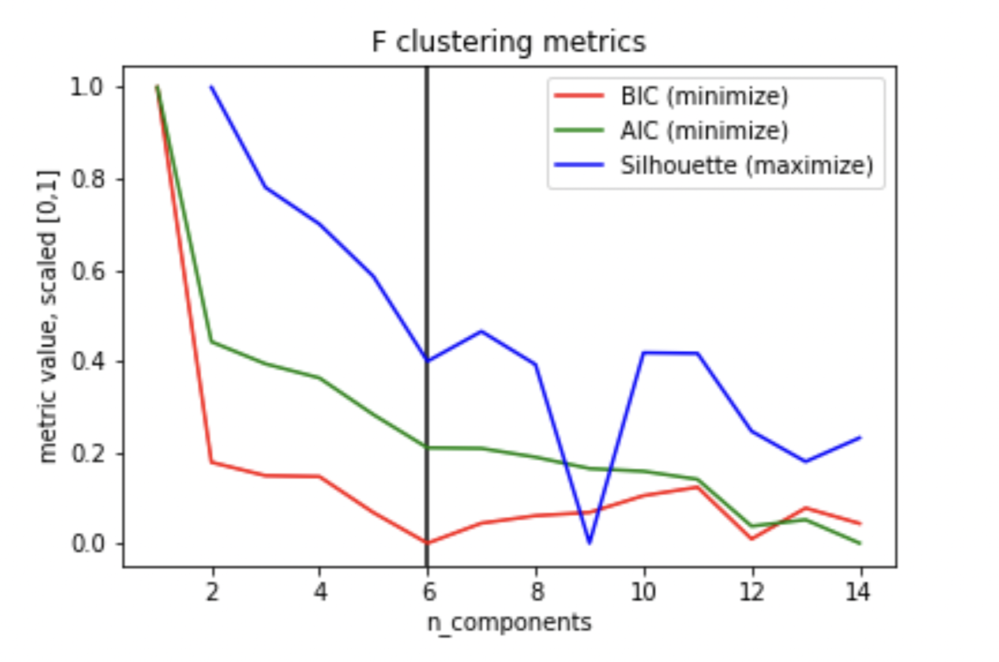

###### Visualization of Ford Stock's Technical Indicator Cluster Metrics

Secondly, half the stocks formed few, vague clusters, signifying that only few meaningful signals can be extracted from the combination of indicators. These clusters are also characterized by an early peaking silhouette score.

###### Visualization of Lowes Stock's Technical Indicator Clusters

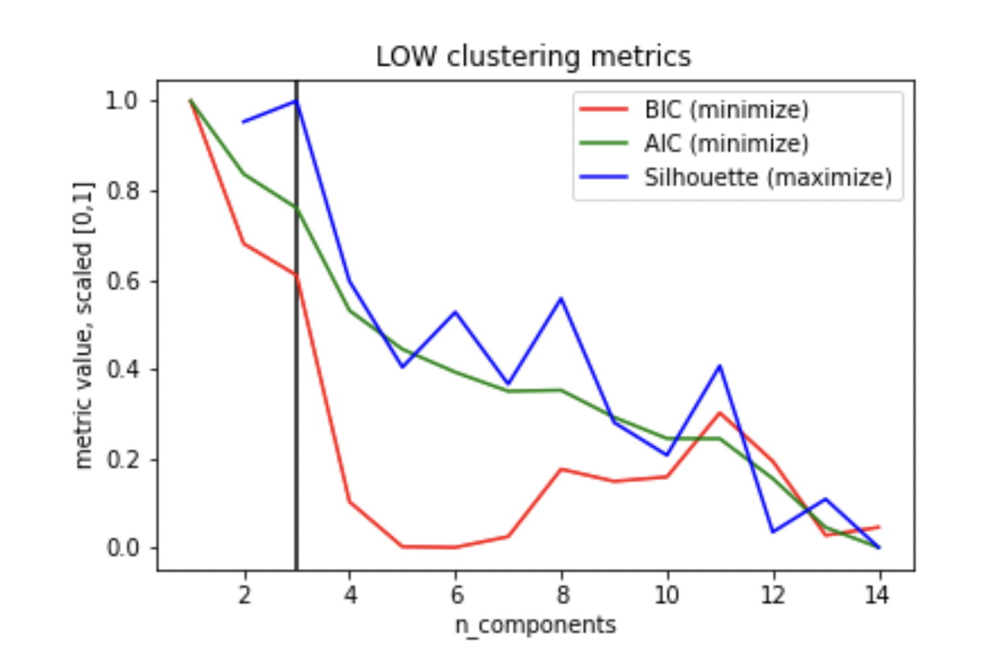

###### Visualization of Lowes Stock's Technical Indicator Cluster Metrics

Thirdly, the remaining stocks overfitting clusters amidst a large cloud of feature points, suggesting that no significant relationship between indicators could be detected for such stocks. Here, it is common for BIC to be minimized late, with a low Silhouette score.

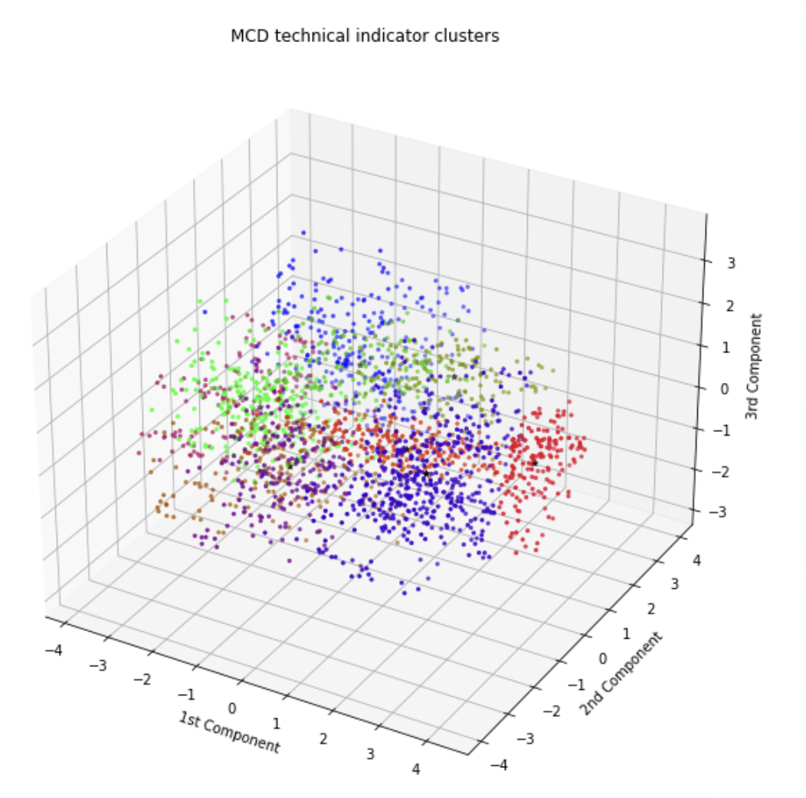

###### Visualization of McDonald’s Stock's Technical Indicator Clusters

###### Visualization of McDonald’s Stock's Technical Indicator Cluster Metrics

Furthermore, taking the optimal number of clusters when performing GMM on each of the stocks' indicators, we can determine that the mean number of clusters (and hence cluster centers) is 5.

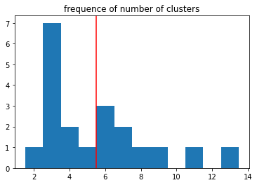

###### Visualization of Number of Clusters per Stock

Applying these findings to the real world, it becomes clear that technical indicators are not a universal, one-size-fits-all tool for making investment decisions. Even when treating the company sector as a constant, technical indicators combine to align signals for some stocks more than others. On the bottom end of the spectrum, some stocks show no clear positive relationship between technical indicators, despite the variety of such indicators that exist. Even at the top of the spectrum, indicators share a positive relationship in a mere general sense; it is somewhat likely that indicators may align, but there is no guarantee that a high degree of confidence is maintained.

#### Supervised Learning Learning

##### Classification Using Naive Bayes

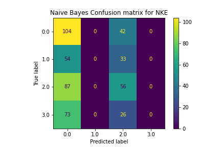

The Naive Bayes model did a poor job of classification. It consistently chose policies that were the most present, often only selecting between one or two labels instead of all 4. This made its accuracy very low and unhelpful for choosing the correct policy.

##### Classification Using SVM
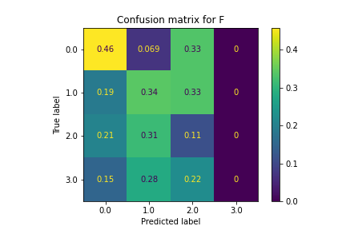

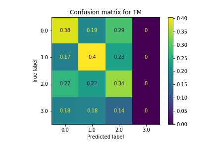

SVM also did not classify the policies very well. Classifications were largely random and led to very inconsistent accuracy levels. This is due to the fact that the pairing of features and optimal stocks were not linearly separable, making SVM ineffective.

##### Classification Using KNN
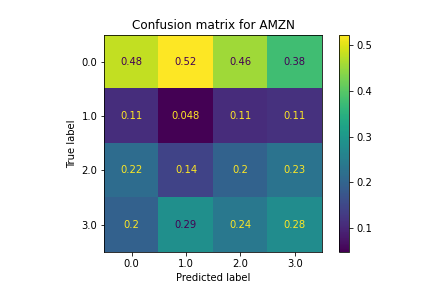

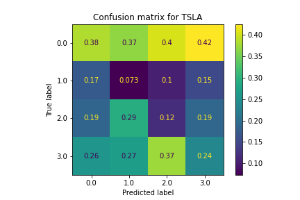

Similar to SVM, the KNN model did not classify particularly well. Features that were similar in the z-space, which we would expect to have similar policies, had lots of variation in predicted policies. For most stocks, this model did not perform any better than randomly selecting labels, making this model not useful to choose correct policies.

##### Classification Using Dense Deep Learning

The Dense Neural Network did not classify policies well. Similar to Naive Bayes, for most stocks there were only one or two labels selected from out of the 4 total, and the predictions were largely inaccurate. Accuracy levels for each stock fluctuated wildly as the number of epochs increased, never converging on any sort of high percentage. Due to the high amount of noise in the training data, overfitting did not occur, but underfitting is a likely explanation for the shortcomings of this model to correctly predict policies.

##### Classification Using LSTM Deep Learning

The LSTM Neural Network also struggled to classify policies. Like the Dense Neural Network, this model had fluctuating accuracy levels as epochs increased, but actually started sharply decreasing accuracy as the number of epochs rose to a high level. This observation combined with the fact that the loss value for the test data increased with epochs suggest that overfitting was a culprit for the ineffectiveness of this model to predict policies.

##### Classification Using CNN
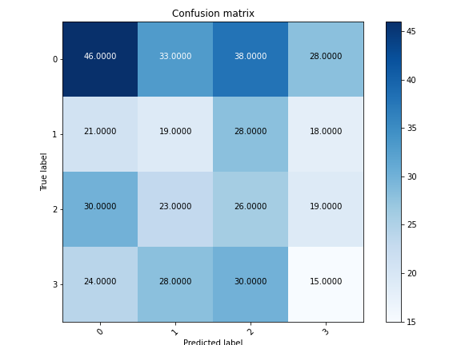

The 1D Convolutional Neural Network (CNN) did not show any form of improvement. We found this model to be very delicate, easily overfitting with a complex CNN model but underfitting when a more simple model was used. With both the complex and the simple CNN, the accuracy levels were not any more effective than random predictions would have been, making it not useful for classifying policies. 

##### Classification Using Random Forest

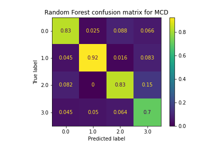

The Random Forest model proved to be very effective for classifying policies, performing better than every other supervised learning method by a large margin. The accuracy levels were above 80%, and this was consistent among all of the stocks. There are a couple reasons why we think this model performed much better than the others for predicting policies: for one, the ensemble method utilized by Random Forest avoids overfitting due to voting, which helped maintain high accuracy levels with the test data. Specific patterns within the data were identified by this model, something the rest of the models were not able to do. Pruning of the trees also helped this model’s performance, as it managed splits that were not productive and reduced overfitting.

### Conclusions
The first thing we noticed when training these models is that we did not have enough data. Initially we had thought that 10 years of stock data would be enough, however the underfitting in almost all of our models proved this was not the case. Secondly, while we didn’t have enough time-series data, we had extreme amounts of extraneous data within the features themselves. This led to our models becoming unable to ascertain what data was important, and what was not. We believe this is the other main contributing factor to the low accuracy within the deep learning models.

One misconception our group had when starting this project is that neural nets are “king,” per se. This means that neural networks are capable of solving any problem with (relative) ease. While we may have not had enough data, and a large amount of irrelevant information, we expected all of our models to overfit over time. This was absolutely not the case. As shown above, ensemble learning actually proved best in this case, something none of us were expecting.

Despite poor accuracies in many of our classification algorithms, ensemble learning proved very effective in predicting the correct policy for our indicators. We believe this is due to Random Forest’s ability to mitigate variance within the dataset. Because it is trained on multiple portions of the data (in our case 100 trees trained on different subsets of features), it is better able to capture the overall function to approximate policy. This shows that there is valuable data within the technical indicators, and that on some level these indicators can be used to help traders make profitable decisions when trading stocks.
