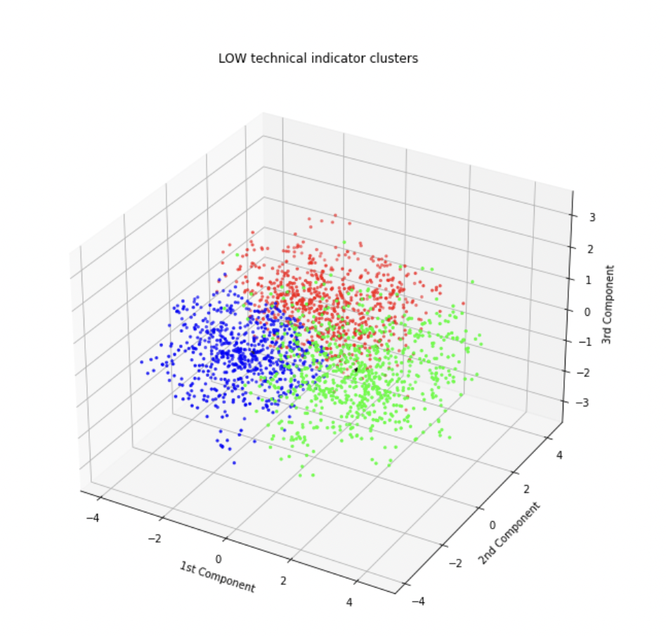
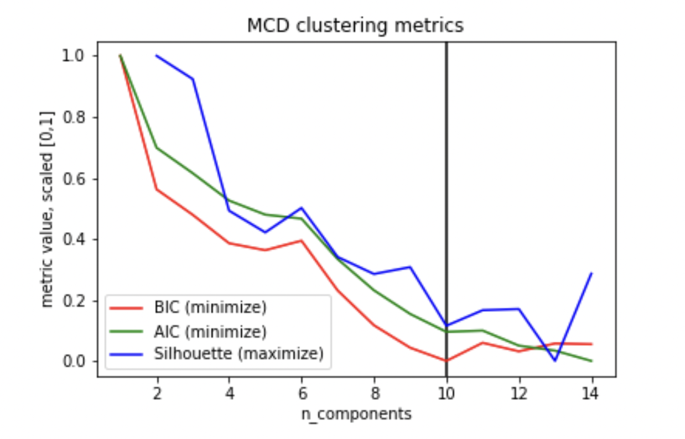

# Analyzing Finanacial Methods - Midterm Report

### Introduction/Background
Today, investment analysis, such as in evaluating stock position strategies, is heavily dependent on technical indicators: functions that extract predefined features from time series. The finance industry relies on technical indicators to quantify time series growth, volatility, patterns, and over/under valued limits.

### Problem Definition
Unfortunately, relying on technical indicators does not always result in profitable investments. This is partially due to the noise and natural variability in financial markets, though we aim to determine the effectiveness of technical indicators with regards to extraction of meaningful, informative features. Diving one level deeper, we wish to model which general investment strategies are most suitable for given indicator values, evaluating the contribution of technical indicators to strategy profitability.

### Data Collection

#### Collecting Stock Data
We began by scraping time series data for a set of 20 stocks in the Consumer Goods industry: Amazon, Tesla, Alibaba, Home Depot, Toyota Motors, NIke, McDonald’s, Lowes, Starbucks, JD.com, Pinduoduo, Booking Holdings, General Motors, Mercadolibre, TJ Max, Nio, Ford Motors, Lululemon Athletica, Honda Motor Co, and Chipotle Mexican Grill. The yFinance Python library allowed us to obtain 10 years of time series data per stock, organized into daily increments. Each data point gives us five values: 
- Opening Price
- Closing Price
- High
- Low
- Volume (Total Shares Traded)

#### Computing Technical Indicators
For each timestep of data collected, we used TA-Lib to collect 14 technical indicators which are commonly used to influence a stock trader’s decision-making strategies. These technical indicators include:
- **Relative Strength Index (RSI):** Oscillates between 0 and 100. Buy signal below 20, Sell signal above 80.
- **Ultimate Oscillator:** Oscillates between 0 and 100. Buy signal below 30, Sell above 70
- **Bollinger Bands:** Width of expected price range, two standard deviations
- **Chaikin Oscillator:** Oscillates between 0 and 100, signals oversold / underbought dependent on Volume
- **Normalized Average True Range (NATR):**  Measure of time series volatility and directional uncertainty
- **Simple Moving Average, 5 day, 20 day, 100 day (SMA)**: Average of last n days
- **Parabolic SAR:** Overlap indicator, buy signal when value jumps from above price to below price, and vice versa
- **Williams %R:** Oscillates between 0 and 100, signifies strength in momentum
- **Absolute Price Oscillator (APO):** Oscillator centered at 0, buy signal when crossing from negative to positive, sell signal when crossing from positive to negative
- **Rate of Change, 5 day, 20 day, 100 day (ROC):** Simple % change in price across a given period of n days

We appended these indicators as new columns of our pandas dataframe, to generate a 10 year by 19 column matrix, where each row corresponded to one day.

### Methods
We will cluster stocks based on technical indicators (GMM). If the clusters are not well-formed (evaluated using a Silhouette matrix), then technical indicators may not be the best for making trading decisions. Otherwise, there may be n distinct trading policies (strategies), where each cluster corresponds to one policy.

#### Outlier Removal
Prior to clustering the data, we removed any outliers. This was done by calculating each feature’s euclidean to the global center, finding the Interquartile Range (IQR) of such distances, and removing any points outside the 1.5*IQR range. This would allow for better clustering results, as the data will not be skewed by a small percentage of outliers.

###### Visualization of Outliers in GM Stock

###### Visualization of CMG Stock Distances from Mean with Outliers

###### Visualization of CMG Stock Distances from Mean with Outliers Removed

#### Dimensionality Reduction Using PCA
In order to visualize the technical indicators for each stock, we reduced our data down to 3 dimensions using PCA. We did this before clustering to manually inspect whether our features could be separated into well-defined clusters. 
To reduce the data to three dimensions, we projected technical indicators along the top three principal components. In this new 3-dimensional space, each data point is a linear combination of data from the original 14-D featurespace. Therefore, if we can see m distinct clusters in three dimensions after performing PCA, then the technical indicators will also have at least m distinct clusters.
PCA was performed on the data using the Sci-Kit Learn library. Prior to performing PCA, we used Sci-Kit Learn’s StandardScaler class to center the data.
Looking at the top three principal components, we can see that the technical indicators for certain stocks form distinct clusters. For Toyota (ticker TM), for example, there are four clear clusters in the reduced data. However, other stocks like Amazon did not have any discernible clusters using the first three principal components. 

###### Visualization of Toyota Stock's Technical Indicator Clusters

###### Visualization of Amazon Stock's Technical Indicator Clusters

###### Visualization of Number of Clusters per Stock

#### Clustering Using GMM
Rather than using K-Means, which is restricted to circular clusters, we chose to use the GMM algorithm with a full covariance matrix. This would give us irregular-shaped clusters, which would be more capable of representing the data. We used Sci-Kit Learn’s GMM function, in which we passed in multiple different cluster numbers, ranging from 1-14. We calculated the BIC (minimize), AIC (minimize), and Silhouette Score (maximize) for each run of GMM, and used whichever metric signaled optimality first to select the number of clusters for each stock. AIC and BIC attempt to optimize the probabilistic assignment for each point, though BIC additionally penalizes models with more clusters without reasonable information gain. From here, we were able to calculate the centroids of the clusters, and store them for use later when choosing ground-truth policies for the stocks.
We ran GMM on the original 14 dimension data, and then we ran GMM on the data preprocessed by PCA.

#### Supervised Learning: Deep Learning
We will begin by simulating what our profit/loss would be for every stock if we applied each trading policy over 3-month periods. This will give us a ground truth measure for how well each trading policy performs on each stock. Using the technical indicators computed earlier as our feature set, we will create a deep LSTM neural network[^3] to predict which trading strategy to use for any given stock. The input will be the set of features for a stock over a 3-month period, and the network output will return the optimal trading policy for that stock.

### Results and Discussion
Initially, we hypothesized that clustering directly over all 14 normalized indicators was sufficient. However, this approach was unsuccessful for two reasons. First, each technical indicator was given an equal weight in the form of its own dimension. In reality, we cannot assume the significance of all technical indicators to be uniform. We combat this by leveraging dimensionality reduction with PCA, then clustering over the top 3 most significant principal components. Secondly, outliers distracted the GMM algorithm from focusing on the grand majority of features in close proximity. Outlier detection and removal before clustering easily cured this shortcoming.

Originally, we planned to overlap all feature vectors for all stocks in a single clustering episode. Seeing that this approach lacks per-stock insight, we decided to deviate from this approach. All clustering was run per-stock, yielding mixed results
No stock formed perfectly distinct clusters, instead forming overlapping clouds around general centers. Clustering results can be split into three categories:
First, few stocks formed several well-fit semi-distinct groups, where the computed optimal number of clusters is well reflected visually. The number of components is generally chosen when BIC is minimized, often with Silhouette showcasing a downtrend.

###### Visualization of Ford Stock's Technical Indicator Clusters

###### Visualization of Ford Stock's Technical Indicator Cluster Metrics

Secondly, half the stocks formed few, vague clusters, signifying that only few meaningful signals can be extracted from the combination of indicators. These clusters are also characterized by an early peaking silhouette score.

###### Visualization of Lowes Stock's Technical Indicator Clusters

###### Visualization of Lowes Stock's Technical Indicator Cluster Metrics

Thirdly, the remaining stocks overfitting clusters amidst a large cloud of feature points, suggesting that no significant relationship between indicators could be detected for such stocks. Here, it is common for BIC to be minimized late, with a low Silhouette score.

###### Visualization of McDonald’s Stock's Technical Indicator Clusters

###### Visualization of McDonald’s Stock's Technical Indicator Cluster Metrics

Applying these findings to the real world, it becomes clear that technical indicators are not a universal, one-size-fits-all tool for making investment decisions. Even when treating the company sector as a constant, technical indicators combine to align signals for some stocks more than others. On the bottom end of the spectrum, some stocks show no clear positive relationship between technical indicators, despite the variety of such indicators that exist. Even at the top of the spectrum, indicators share a positive relationship in a mere general sense; it is somewhat likely that indicators may align, but there is no guarantee that a high degree of confidence is maintained.

Following the unsupervised section of the project, we look ahead to reinforcing our evaluation of common financial methods with a supervised component. Having obtained the centers for the detected clusters and inversely transformed them to their original form, we can formulate policies supporting such indicator values. For instance, a discovered center that is defined by its low RSI and Parabolic SAR values signify that the stock price is commonly reaching a local minimum: a suitable investment policy is to wait for this dip, buy at the local minimum, and sell before the prices dives down again. In phase II of the project, we want to select the most common policies following the centers found when clustering across the 20 stocks, and training a Neural Network model to correctly classify technical indicator values in a time series to the best investment policy. If this model performs accurately, we can conclude that indicators do present a sound way to make worthwhile investments. By contrast, an error-prone model would suggest that technical indicators do not encapsulate information significant enough to optimize profits, despite the greater financial industry’s assumption.

### Proposed Timeline
- Week 0: Trading Policy Formulation **[Michael]**
- Week 0: Simulation of Ground-Truth Data **[Austin]**
- Weeks 1-2: Policy Prediction using Deep Neural Networks and Regression **[Dylan/Munim]**
- Week 3: Final Result Analysis **[Blake]**

### References
[^1]: Zhai Y., Hsu A., Halgamuge S.K. (2007) Combining News and Technical Indicators in Daily Stock Price Trends Prediction. In: Liu D., Fei S., Hou Z., Zhang H., Sun C. (eds) Advances in Neural Networks – ISNN 2007. ISNN 2007. Lecture Notes in Computer Science, vol 4493. Springer, Berlin, Heidelberg. 
[^2]: Yauheniya Shynkevich, T.M. McGinnity, Sonya A. Coleman, Ammar Belatreche, Yuhua Li, “Forecasting price movements using technical indicators: Investigating the impact of varying input window length, ” Neurocomputing, 2017, pp. 71-88, https://doi.org/10.1016/j.neucom.2016.11.095.
[^3]: P. Oncharoen and P. Vateekul, "Deep Learning for Stock Market Prediction Using Event Embedding and Technical Indicators," 2018 5th International Conference on Advanced Informatics: Concept Theory and Applications (ICAICTA), 2018, pp. 19-24, doi: 10.1109/ICAICTA.2018.8541310.
